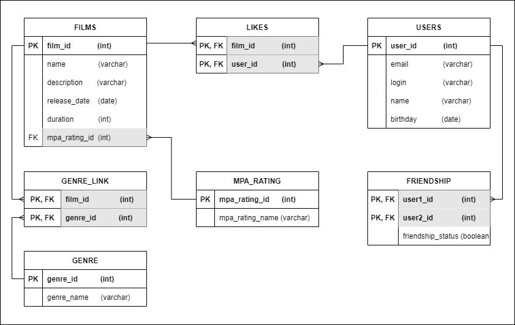

# java-filmorate
Filmorate project.

# ER - diagram
DataBase structure

Friends relationships explanation

# Examples
# 1. Find all Films:
SELECT *
FROM film;

# 2. Find all Users:
SELECT *
FROM user;

# 3. Top 10 the most popular films:
SELECT f.*
FROM film f join "like" l ON f.film_id = l.film_id
WHERE like_status = true
GROUP BY f.film_id
ORDER BY COUNT(l.user_id) DESC
LIMIT 10;

# 4. Get all friends of user id=1:
SELECT * FROM "user"
WHERE user_id IN (SELECT user2_id FROM friendship WHERE user1_id = 1 AND friendship_status = true)
OR  user_id IN (SELECT user1_id FROM friendship WHERE user2_id = 1 AND friendship_status = true)
ORDER BY user_id;

# 5. List of common friends of user id=1 and user id=2
SELECT * FROM "user"
WHERE user_id IN (SELECT user2_id FROM friendship WHERE user1_id = 1 AND friendship_status = true)
OR  user_id IN (SELECT user1_id FROM friendship WHERE user2_id = 1 AND friendship_status = true)
UNION --INTERSECT (if we need intersection only)
SELECT * FROM "user"
WHERE user_id IN (SELECT user2_id FROM friendship WHERE user1_id = 2 AND friendship_status = true)
OR  user_id IN (SELECT user1_id FROM friendship WHERE user2_id = 2 AND friendship_status = true)
ORDER BY user_id;

# 6. Top 10 films by likes
SELECT f.*
FROM film f join "like" l ON f.film_id = l.film_id
WHERE like_status = true
GROUP BY f.film_id
ORDER BY COUNT(l.user_id) DESC
LIMIT 10;

# 7. Top 10 Dramas by likes
SELECT f.*
FROM film f join "like" l ON f.film_id = l.film_id
WHERE f.film_id IN (SELECT film_id FROM genre_link WHERE genre_id IN
                   (SELECT genre_id FROM genre WHERE genre = 'Drama'))
AND like_status = true
GROUP BY f.film_id
ORDER BY COUNT(l.user_id) DESC
LIMIT 10;